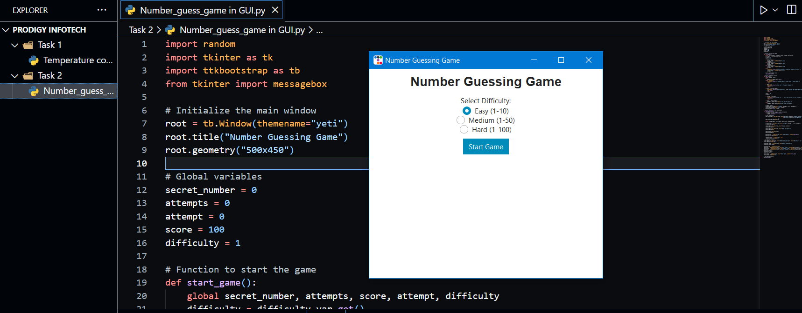

# PRODIGYINFOTECH_SD_02
# 🎯 Prodigy InfoTech Internship - Task 02

## 🧩 Number Guessing Game (GUI using Tkinter & ttkbootstrap)

### 📌 Objective:
Build an interactive and visually appealing **Number Guessing Game** using **Python**, **Tkinter**, and the **ttkbootstrap** library. The user selects a difficulty level and tries to guess a randomly chosen number, receiving real-time feedback and scoring.

---

### 🧠 Description:
This project features a fun GUI-based game where players guess a number within a specific range depending on the selected difficulty. The program provides helpful messages like:
- “Too High”
- “Too Low”
- “Correct!”

It also tracks the player's score and allows replaying the game with ease.

---

### 🚀 Features:
- 🎚️ **Difficulty Levels**:
  - **Easy**: Range 1–10
  - **Medium**: Range 1–50
  - **Hard**: Range 1–100
- 🎯 Random number generation based on selected difficulty
- ✅ Real-time feedback: “Too High”, “Too Low”, “Correct!”
- 🏆 Score tracking system
- 🔁 Game restart and exit options
- 🎨 Sleek and responsive GUI built using `ttkbootstrap`

---

### 🛠️ Technologies Used:
- Python 3.x
- tkinter (for GUI)
- ttkbootstrap (for modern-themed UI)

---

### ▶️ How to Run:
1. Install Python 3.x (if not already installed).
2. Install the required library:
   bash
   pip install ttkbootstrap
   python number_guessing_game_gui.py

🖼️ Screenshot:

### 🖼️ Screenshot:

### 🖼️ Screenshot:
[.PNG)](task-02(2).PNG)

task-02(2).PNG
<!-- Replace `your_screenshot_filename.png` with the actual file name like `screenshot.png` -->
🎮 How It Works:
User selects a difficulty level from a dropdown.

A random number is generated in the range of the selected level.

User inputs guesses.

The app gives instant feedback:

“Too High” if the guess is above the number.

“Too Low” if the guess is below the number.

“Correct!” if the number matches.

Score is calculated based on attempts.

After the game ends, the user can choose to play again or exit.

✍️ Author:
Name: Muhammad Yasir

Internship Program: Prodigy InfoTech – Python Programming

Task: 02 – Number Guessing Game (GUI)

📧 Email: yaisikhan111@gmail.com

<!-- Replace `your_email@example.com` with your real email -->
📌 Note:
This project is created as part of the Prodigy InfoTech Virtual Internship Program and showcases Python GUI development with interactive game logic and responsive design.

🌟 Optional Enhancements:
🧠 Add a hint system after X failed attempts

⏱️ Add a countdown timer to increase difficulty

🏅 Store high scores using a local file or SQLite
